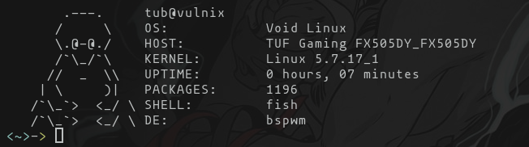

<h1 align="center">lfetch</h1>

A minimal fetch program written in C 

	

## Table of Contents

* [About](#about)
* [Installation](#installation)

### About

A fetch tool that fetches the information about the (Linux) system and displays it. This tool can be used as an alternative for `neofetch`, `ufetch`, `pfetch`, etc. Written in C programming language. Currently only for `Void Linux`.

### Installation

**Prerequisites**

* `GCC` (The GNU Compiler Collection)
* GNU Make

**Make and Install**

* Clone the repo (`git clone https://github.com/TheUpBeat/lfetch.git`)
* Change in the directory (`cd lfetch`)
* Using Make build it (`make`)
* Install the program (`sudo make install`)

To uninstall `sudo make uninstall`
